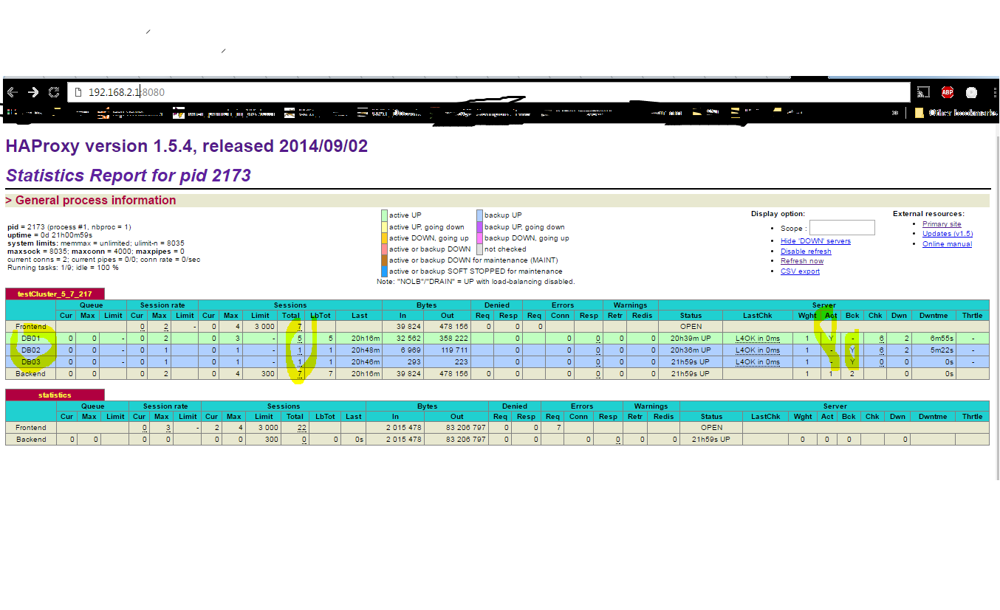

<strong>&nbsp;</strong>

Contents

<ol>
<li><a href="#_Toc467586650"> Introduction. 2</a></li>
<li><a href="#_Toc467586651"> Scope. 2</a></li>
<li><a href="#_Toc467586652"> Intendant audience. 2</a></li>
<li><a href="#_Toc467586653"> High Level diagram.. 2</a></li>
<li><a href="#_Toc467586654"> Used tools. 3</a></li>
<li><a href="#_Toc467586655"> Configuration and setup. 3</a></li>
</ol>

<a href="#_Toc467586656">6.1 Percona XtraDB Cluster Configurations: 3</a>

<a href="#_Toc467586657">6.2 Load Balancing (LB). 6</a>

<a href="#_Toc467586658">6.2.1 HaProxy Configuration: 7</a>

<a href="#_Toc467586659">6.2.2 Keepalived configuration. 8</a>

&nbsp;

&nbsp;

<strong>&nbsp;</strong>

<h1>1.&nbsp;&nbsp;&nbsp;&nbsp; Introduction</h1>

This document is giving high level configuration about Percona 5.7, 3 node cluster with High Availability.

<h1>2.&nbsp;&nbsp;&nbsp;&nbsp; Scope</h1>

This document covers about Percona db cluster setup and configuration in centos.

<h1>3.&nbsp;&nbsp;&nbsp;&nbsp; Intendant audience</h1>

All configuration and setup is being done on Centos&nbsp; 6, Linux platform. So Database Administrator or System Administrator or Developer should have basic knowledge of Linux command, MySQL database information to follow this document.

<h1>4.&nbsp;&nbsp;&nbsp;&nbsp; High Level diagram</h1>
  
  
<h1>5.&nbsp;&nbsp;&nbsp;&nbsp; Used tools &nbsp;</h1>
<ul>
<li>Percona 5.7 cluster</li>
<li>HaProxy</li>
<li>KeepAlived</li>
<li>Yum</li>
</ul>
<h1>6.&nbsp;&nbsp;&nbsp;&nbsp; Configuration and setup</h1>
<h2>6.1 Percona XtraDB Cluster Configurations:</h2>

Percona is an open source software company specializing in MySQL, MongoDB, and other open source database support, consulting, managed services, and training.

Percona XtraDB Cluster is an active/active high availability and high scalability open source solution for MySQL clustering. It integrates Percona Server and Percona XtraBackup with the Codership Galera library of MySQL high availability solutions in a single package that enables you to create a cost-effective MySQL high availability cluster.

We can found more information

<a href="https://www.percona.com/software/mysql-database/percona-xtradb-cluster">https://www.percona.com/software/mysql-database/percona-xtradb-cluster</a>

<strong>Installation Documentation</strong>: <a href="https://www.percona.com/downloads/Percona-XtraDB-Cluster-57/LATEST/">https://www.percona.com/downloads/Percona-XtraDB-Cluster-57/LATEST/</a>

This document only consist configuration and setup latest version 5.7. It needs to be setup in each node. Based on above diagram, we are doing in 3 nodes. 3 node clusters is best practice for clustering.

<ul>
<li><strong>Node 1: 192.168.2.4, Node 2: 192.168.2.5, Node 3: 192.168.2.6, </strong>are the used node ip here for identification<strong>. </strong>We will be installing Percona cluster in each node.</li>
<li>Percona XtraDB Cluster does not work with <strong><em>SELinux</em></strong> and <strong><em>AppArmor</em></strong> security modules. Make sure these modules are disabled in each node</li>
<li>Cent os 6 is being used as Linux Platform. Some command and process may be different base on platform.</li>
<li>If platform already have MySQL-server, then it will conflict. We will remove it.   <strong>#yum remove mysql mysql-server</strong></li>
<li>We can install Percona by yum repository, rpm or manual download.&nbsp; Here we are using Yum repository. We may need to add Percona repository in platform yum repository. For further you can follow Percona&rsquo;s&nbsp; official <a href="https://www.percona.com/downloads/Percona-XtraDB-Cluster-57/LATEST/">documentation</a>. &nbsp;</li>
</ul>

&nbsp;

&nbsp;

<ul>
<li>If any OS library missing. We need to install library in OS before start installing Percona cluster. Like my case. I need to install <strong>libev </strong>required by Percona itself. I followed in each node.</li>
</ul>

## RHEL/CentOS 6 32-Bit ##

# wget http://download.fedoraproject.org/pub/epel/6/i386/epel-release-6-8.noarch.rpm

# rpm -ivh epel-release-6-8.noarch.rpm

## RHEL/CentOS 6 64-Bit ##

# wget http://download.fedoraproject.org/pub/epel/6/x86_64/epel-release-6-8.noarch.rpm

# rpm -ivh epel-release-6-8.noarch.rpm

yum install libev

<ul>
<li>Then we can start installation in any node. You can pick 1st node (<strong>168.2.4</strong>)</li>
</ul>

# yum install Percona-XtraDB-Cluster-57

<ul>
<li>After installation complete. Follow following step
<ul>
<li>Individual nodes should be configured to be able to bootstrap the cluster. For more information about bootstrapping the cluster, see Bootstrapping the cluster.</li>
<li><strong>Configuration of First node:</strong></li>
</ul>
</li>
</ul>
<ol>
<li>Make sure that the configuration file /etc/my.cnf on the first node (Node 1) contains the following:  <em>[mysqld]</em></li>
</ol>

<em>datadir=/var/lib/mysql</em>

<em>user=mysql</em>

<em># Path to Galera library</em>

<em>wsrep_provider=/usr/lib64/libgalera_smm.so</em>

<em># Cluster connection URL contains the IPs of node#1, node#2 and node#3</em>

<em>wsrep_cluster_address=gcomm://</em><strong> 192.168.2.4, 192.168.2.5, 192.168.2.6  </strong><em># In order for Galera to work correctly binlog format should be ROW</em>

<em>binlog_format=ROW</em>

<em># MyISAM storage engine has only experimental support</em>

<em>default_storage_engine=InnoDB</em>

<em># This InnoDB autoincrement locking mode is a requirement for Galera</em>

<em>innodb_autoinc_lock_mode=2</em>

<em># Node 1 address</em>

<em>wsrep_node_address=</em><strong>192.168.2.4</strong>

<em># SST method</em>

<em>wsrep_sst_method=xtrabackup-v2</em>

<em># Cluster name</em>

<em>wsrep_cluster_name=my_centos_cluster</em>

<em># Authentication for SST method</em>

<em>wsrep_sst_auth="sstuser:s3cret"</em>

<ol start="2">
<li><em> Start the first node with the following command:  [root@node1 ~]# /etc/init.d/mysql bootstrap-pxc</em></li>
<li><em>After running step 2 command, default root password will be displayed at screen. That password should be used to loing mysql using root user. For more information   </em><a href="https://www.percona.com/blog/2016/05/18/where-is-the-mysql-5-7-root-password/"><em>https://www.percona.com/blog/2016/05/18/where-is-the-mysql-5-7-root-password/</em></a><em>  # mysql -u root &ndash;p  Enter password:&lt;hit default password&gt;    </em></li>
<li><em>after first time login. mysql 5.7 force to reset root password:  mysql&gt; ALTER USER 'root'@'localhost' IDENTIFIED BY 'P@ssw0rd';  mysql&gt; flush privileges;</em></li>
<li><em>After the first node has been started, cluster status can be checked with the following command:  mysql&gt; show status like &rsquo;wsrep%&rsquo;;</em></li>
<li>To perform State Snapshot Transfer using XtraBackup, set up a new user with proper privileges:  <em>mysql@Node1&gt; CREATE USER &rsquo;sstuser&rsquo;@&rsquo;localhost&rsquo; IDENTIFIED BY &rsquo;s3cret&rsquo;;  mysql@Node1&gt; GRANT RELOAD, LOCK TABLES, REPLICATION CLIENT ON *.* TO &rsquo;sstuser&rsquo;@&rsquo;localhost&rsquo;;  mysql@Node1&gt; FLUSH PRIVILEGES;</em></li>
</ol>
<ul>
<li><strong>Configuration of Second node:</strong></li>
</ul>
<ol>
<li>Make sure that the configuration file /etc/my.cnf on the first node (Node 2) contains the following:</li>
</ol>

<em>[mysqld]</em>

<em>datadir=/var/lib/mysql</em>

<em>user=mysql</em>

<em># Path to Galera library</em>

<em>wsrep_provider=/usr/lib64/libgalera_smm.so</em>

<em># Cluster connection URL contains the IPs of node#1, node#2 and node#3</em>

<em>wsrep_cluster_address=gcomm://</em><strong> 192.168.2.4, 192.168.2.5, 192.168.2.6  </strong><em># In order for Galera to work correctly binlog format should be ROW</em>

<em>binlog_format=ROW</em>

<em># MyISAM storage engine has only experimental support</em>

<em>default_storage_engine=InnoDB</em>

<em># This InnoDB autoincrement locking mode is a requirement for Galera</em>

<em>innodb_autoinc_lock_mode=2</em>

<em># Node 1 address</em>

<em>wsrep_node_address=</em><strong>192.168.2.5</strong>

<em># SST method</em>

<em>wsrep_sst_method=xtrabackup-v2</em>

<em># Cluster name</em>

<em>wsrep_cluster_name=my_centos_cluster</em>

<em># Authentication for SST method</em>

<em>wsrep_sst_auth="sstuser:s3cret"</em>

<ol start="2">
<li><em>Start the second node with the following command</em></li>
</ol>

[root@node2 ~]# /etc/init.d/mysql start

<ol start="3">
<li><em>Check node status  </em>mysql&gt; <strong>show </strong>status <strong>like </strong>&rsquo;wsrep%&rsquo;;</li>
</ol>

<strong>  </strong>

<ul>
<li><strong>Configuration of Third node:</strong></li>
</ul>
<ol>
<li>Make sure that the configuration file /etc/my.cnf on the first node (Node 2) contains the following:</li>
</ol>

<em>[mysqld]</em>

<em>datadir=/var/lib/mysql</em>

<em>user=mysql</em>

<em># Path to Galera library</em>

<em>wsrep_provider=/usr/lib64/libgalera_smm.so</em>

<em># Cluster connection URL contains the IPs of node#1, node#2 and node#3</em>

<em>wsrep_cluster_address=gcomm://</em><strong> 192.168.2.4, 192.168.2.5, 192.168.2.6  </strong><em># In order for Galera to work correctly binlog format should be ROW</em>

<em>binlog_format=ROW</em>

<em># MyISAM storage engine has only experimental support</em>

<em>default_storage_engine=InnoDB</em>

<em># This InnoDB autoincrement locking mode is a requirement for Galera</em>

<em>innodb_autoinc_lock_mode=2</em>

<em># Node 1 address</em>

<em>wsrep_node_address=</em><strong>192.168.2.6</strong>

<em># SST method</em>

<em>wsrep_sst_method=xtrabackup-v2</em>

<em># Cluster name</em>

<em>wsrep_cluster_name=my_centos_cluster</em>

<em># Authentication for SST method</em>

<em>wsrep_sst_auth="sstuser:s3cret"</em>

<ol start="2">
<li><em>Start the third node with the following command</em></li>
</ol>

[root@node2 ~]# /etc/init.d/mysql start

<ol start="3">
<li><em>Check node status  </em>mysql&gt; <strong>show </strong>status <strong>like </strong>&rsquo;wsrep%&rsquo;;</li>
</ol>
<ul>
<li>After configuring replication can be tested using any DML operation in one Node and checking in another node. If everything ok then all node synching together.</li>
</ul>

<em>&nbsp;</em>

<h2>6.2 Load Balancing (LB)</h2>

For load balancing, here we are using 2 load balancing server with one virtual ip as Proxy server for Application to DB connection. For HA concept, Application will be connection DB through proxy IP. During connection time one of the LB will be chosen during connection time. This will be managed by Keepalived. If one LB is down then automatically another LB will be used. So we can make 2 LB server in two different type of network. As a result application can connect DB server if one side of network down.

Some programming language support itself supports load blancing during connection time. For example, java has its own connection pool mechanism where can directly give node ip in application configuration.

&nbsp;

&nbsp;

<h3>6.2.1 HaProxy Configuration:</h3>

  HAProxy is a free, very fast and reliable solution offering high availability, load balancing, and proxying for TCP and HTTP-based applications. It is particularly suited for very high traffic web sites and powers quite a number of the world's most visited ones. Over the years it has become the de-facto standard opensource load balancer, is now shipped with most mainstream Linux distributions, and is often deployed by default in cloud platforms

<ul>
<li>We will be installing Haproxy in both LB server. <strong><em>#yum install haproxy</em></strong></li>
<li>After installation we need to add entry in its configuration file(<strong>/etc/haproxy/haproxy.cfg</strong>) based on our requirement</li>
<li>Sample haproxy.cfg will be available in this document folder.</li>
<li>Mainly we need to add entry about request(connection request, http request) which to be load balanced and sever entries with their connectivity strategy.<strong>,  for example:</strong>  server NODE01 <strong>168.2.4</strong>:3306 check  server NODE02 <strong>192.168.2.5</strong>:3306 check backup  server NODE03 <strong>192.168.2.6</strong>:3306 check backup
<ul>
<li>Here all first loads goes to NODE1 because it is configured as check and rest NODEs are configure as check with backup purpose. This parameter might need to be configured based on requirement.</li>
</ul>
</li>
<li>We can monitor all request status and NODE status through browsing Proxy IP or each LB IP. For this, We need to add following configuration in <strong>cfg  </strong>listen statistics *:8080</li>
</ul>

&nbsp;&nbsp; mode http  &nbsp;stats enable  #&nbsp;&nbsp;&nbsp; stats hide-version  &nbsp;&nbsp;&nbsp; stats realm Haproxy\ Statistics&nbsp;&nbsp;&nbsp; stats realm .  &nbsp;&nbsp;&nbsp; stats uri /  &nbsp;&nbsp;&nbsp; stats auth admin:P@ssw0rd  &nbsp;&nbsp;&nbsp; stats refresh 5s

&nbsp;

&nbsp;

<ul>
<li>After this configuration ,we can monitor http:// 192.168.2.1:8080</li>
</ul>
  
<h3>6.2.2 Keepalived configuration</h3>
<ul>
<li>Keepalived tool uses to select one LB at a time. This tool will be installed in both LB server .i.e. 192.168.2.2 and 192.168.2.3 are LB servers based on above diagram. Virtual IP will be added in keepalived.conf configuration file.</li>
<li>Installation of Keeplived in each LB server.  # yum install keepalived</li>
<li>Edit the Keepalived configuration file based on requirement. /etc/keepalived/keepalived.conf&nbsp;&nbsp;&nbsp;&nbsp;&nbsp;&nbsp;&nbsp;&nbsp;&nbsp;&nbsp;&nbsp;&nbsp;&nbsp;&nbsp;&nbsp;</li>
<li>For more information at <a href="https://docs.oracle.com/cd/E37670_01/E41138/html/section_uxg_lzh_nr.html">https://docs.oracle.com/cd/E37670_01/E41138/html/section_uxg_lzh_nr.html</a></li>
<li>Sample keepalived.conf will be in this document folder.</li>
</ul>

To create auto startup during OS loading time :  #chkconfig keepalived on  #chkconfig haproxy on

&nbsp;

&nbsp;

&nbsp;

&nbsp;

